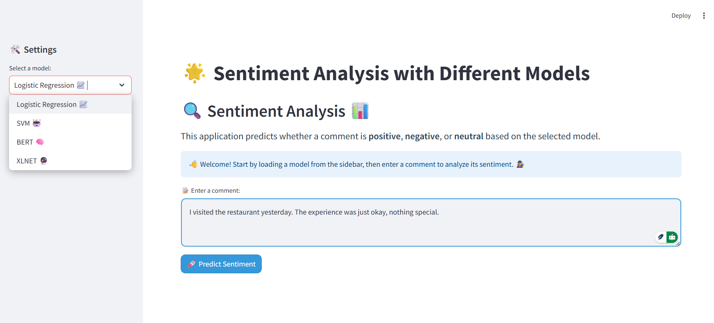
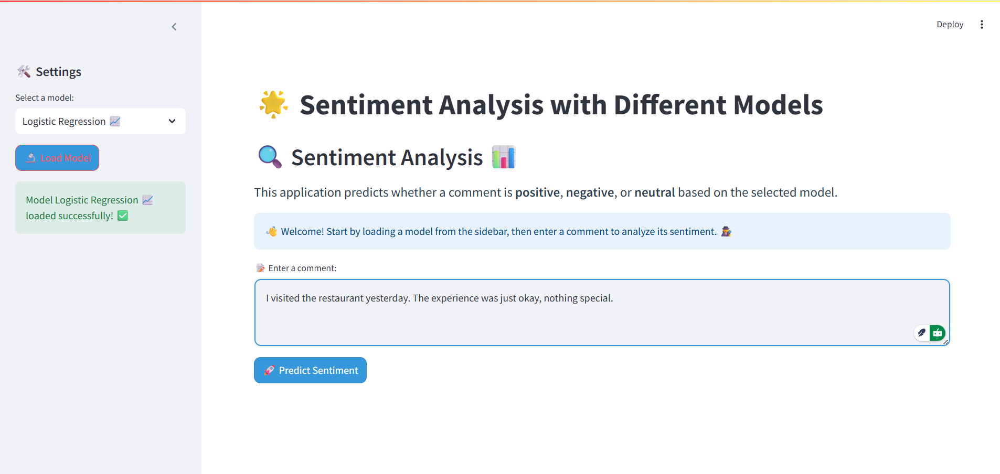
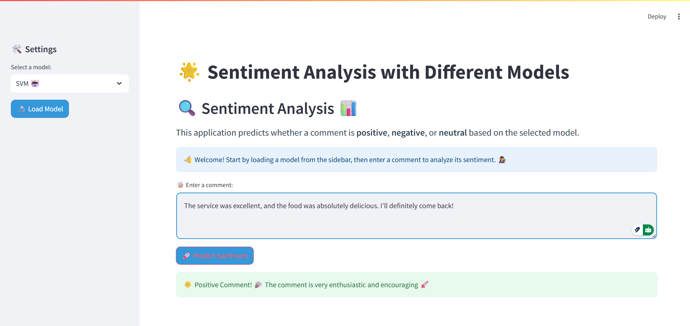
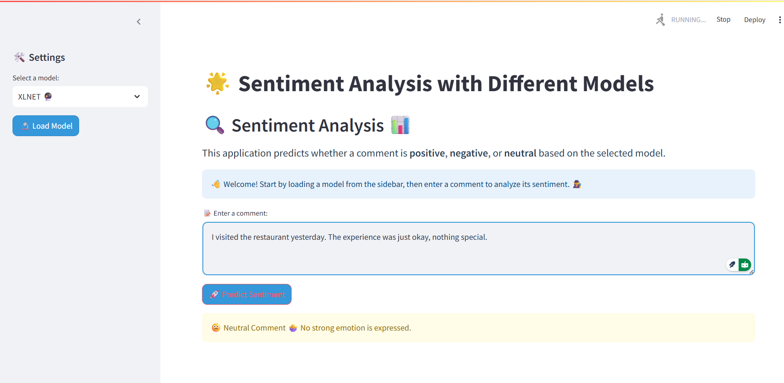

# 📊 Classificateur d'Avis Clients - NLP & Machine Learning

[](https://www.python.org/downloads/)
[](https://streamlit.io)
[](https://huggingface.co/models)
[](https://github.com/Alae-Eddine-Akesbi/CustomerReviewClassifier)

Ce projet présente un pipeline complet de Machine Learning et de NLP pour la classification de sentiments (positif, négatif, neutre) à partir d'avis clients. Il explore et compare la performance de modèles classiques (Régression Logistique, SVM) avec des modèles de Deep Learning de pointe (BERT, XLNet).

## 🚀 Démonstration

Une application web interactive construite avec **Streamlit** permet de tester et de comparer les prédictions des différents modèles en temps réel.


## 🗂️ Structure du Projet

Le projet est organisé de manière professionnelle pour assurer la clarté, la maintenabilité et la reproductibilité.

```
/
|-- app.py                  # L'application web Streamlit pour l'inférence.
|-- requirements.txt        # Les dépendances Python du projet.
|-- data/
|   |-- balanced_subset.csv   # Le jeu de données nettoyé et équilibré.
|-- models/
|   |-- logistic_regression/  # Modèle, vectoriseur et encodeur pour la Régression Logistique.
|   |-- svm/                  # Modèle et vectoriseur pour le SVM.
|   |-- bert_lora/            # Modèle BERT fine-tuné avec LoRA et tokenizer.
|   |-- xlnet/                # Modèle XLNet fine-tuné et tokenizer.
|-- notebooks/
|   |-- 1_Data_Preprocessing.ipynb
|   |-- 2_Logistic_Regression.ipynb
|   |-- 3_SVM.ipynb
|   |-- 4_BERT_Fine_Tuning.ipynb
|   |-- 5_XLNet_Fine_Tuning.ipynb
|   |-- 6_Model_Comparison.ipynb
|-- README.md                 # Ce fichier.
```

## 💾 Données

Les données originales proviennent du [**Yelp Open Dataset**](https://business.yelp.com/data/resources/open-dataset/), une ressource riche contenant des millions d'avis.

Le fichier `data/balanced_subset.csv` est le résultat d'un processus de **Data Engineering** et de **prétraitement** détaillé dans le notebook `1_Data_Preprocessing.ipynb`. Ce processus inclut le nettoyage, la normalisation du texte (lemmatisation, suppression des stopwords) et un échantillonnage stratifié pour équilibrer les classes.

## ⚙️ Installation et Utilisation

Pour lancer ce projet localement, suivez ces étapes :

1.  **Clonez le dépôt :**
    ```bash
    git clone https://github.com/Alae-Eddine-Akesbi/CustomerReviewClassifier.git
    cd CustomerReviewClassifier
    ```

2.  **Créez un environnement virtuel (recommandé) :**
    ```bash
    python -m venv venv
    source venv/bin/activate  # Sur Windows: venv\Scripts\activate
    ```

3.  **Installez les dépendances :**
    ```bash
    pip install -r requirements.txt
    ```

4.  **Lancez l'application Streamlit :**
    ```bash
    streamlit run app.py
    ```

L'application s'ouvrira dans votre navigateur, vous permettant de choisir un modèle, d'entrer un texte et d'obtenir une prédiction de sentiment.

## 🧠 Modèles

Ce projet compare quatre approches de modélisation :

1.  **Régression Logistique** : Un modèle linéaire classique, rapide et interprétable.
2.  **Support Vector Machine (SVM)** : Un modèle puissant basé sur la recherche d'hyperplans à marge maximale.
3.  **BERT (avec LoRA)** : Un modèle Transformer de pointe, fine-tuné efficacement grâce à la technique Low-Rank Adaptation (LoRA).
4.  **XLNet** : Un autre modèle Transformer performant, utilisant une approche de modélisation de langage par permutation.

La comparaison détaillée des performances se trouve dans le notebook `6_Model_Comparison.ipynb`.

## 🖼️ Visualisation

Voici quelques captures d'écran de l'application Streamlit en action :

**Sélection du modèle :**


**Prédiction avec la Régression Logistique :**


**Prédiction avec le SVM (commentaire positif) :**


**Prédiction avec BERT (commentaire négatif) :**


**Prédiction avec XLNet (commentaire neutre) :**

